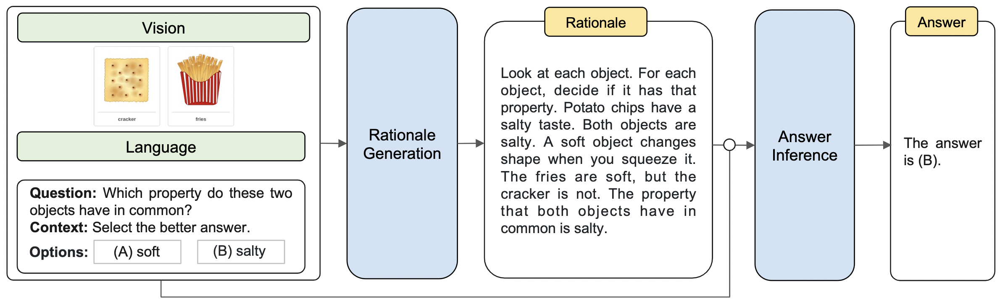

# Multimodal Chain-of-Thought Reasoning in Language Models

<h5 align="center"><i>"Imagine learning a textbook without figures or tables."</i></h5>

Multimodal-CoT incorporates vision features in a decoupled training framework. The framework consists of two training stages: (i) rationale generation and (ii) answer inference. Both stages share the same model architecture but differ in the input and output.




## Requirements

Install all required python dependencies:

```
pip install -r requirements.txt
```

## Datasets

Download the dataset from the following repository:

```
https://github.com/lupantech/ScienceQA/tree/main/data
```
The vision features (detr, resnet, clip, vit) are available at https://huggingface.co/cooelf/vision_features/tree/main

Alternatively, you may download the extracted vision features (detr, resnet, clip) from [vision_features](https://drive.google.com/file/d/13B0hc_F_45-UlqPLKSgRz-ALtFQ8kIJr/view?usp=share_link) and unzip the files under `vision_features`

## Extract Features (optional)

The processed vision features for ScienceQA are available at https://huggingface.co/cooelf/vision_features/tree/main. 

The following instructions show how we obtain those features.

Download the image files from [Google Drive](https://drive.google.com/drive/folders/1w8imCXWYn2LxajmGeGH_g5DaL2rabHev?usp=sharing) and unzip all the images (train, dev, test) in the same folder (). The structure should be:

```
images
├── 1
│   └── image.png
├── 2
│   └── image.png
├── 3
│   └── image.png
├── 5
│   └── image.png
├── 7
│   └── image.png
```

Run ```extract_features.py --data_root images --output_dir vision_features --img_type vit```

If you hope to use your own images, please structure those images in the way above, or modify the script ```extract_features.py```.

## Extract Captions (optional)

The processed captions for ScienceQA are available at ```data/instruct_captions.json```. 

The following instructions show how we obtain those features.

Intall lavis and prepare Vicuna weights to use InstructBLIP for caption extraction.

https://github.com/salesforce/LAVIS/tree/f982acc73288408bceda2d35471a8fcf55aa04ca/projects/instructblip

Assume that the images are stored in the ```images``` folder. 

```
python extract_caption.py
```

## Instructions

### Training 

```
# rationale generation
CUDA_VISIBLE_DEVICES=0,1,2,3 python main.py \
    --data_root data/ScienceQA/data \
    --caption_file data/instruct_captions.json \
    --model declare-lab/flan-alpaca-large \
    --user_msg rationale --img_type vit \
    --bs 2 --eval_bs 4 --epoch 50 --lr 5e-5 --output_len 512 \
    --use_caption --use_generate --prompt_format QCM-E \
    --output_dir experiments

# answer inference
CUDA_VISIBLE_DEVICES=0,1,2,3 python main_central.py \
    --data_root data/ScienceQA/data \
    --caption_file data/instruct_captions.json \
    --model declare-lab/flan-alpaca-large \
    --user_msg answer --img_type vit \
    --bs 4 --eval_bs 8 --epoch 50 --lr 5e-5 --output_len 64 \
    --use_caption --use_generate --prompt_format QCMG-A \
    --output_dir experiments \
    --eval_le experiments/rationale_declare-lab-flan-alpaca-large_vit_QCM-E_lr5e-05_bs8_op512_ep50/predictions_ans_eval.json \
    --test_le experiments/rationale_declare-lab-flan-alpaca-large_vit_QCM-E_lr5e-05_bs8_op512_ep50/predictions_ans_test.json

```

### Inference 

Our trained models are available at https://huggingface.co/cooelf/mm-cot/tree/main. To use our trained models, please put the them under the ```models``` folder.

```
# rationale generation
CUDA_VISIBLE_DEVICES=0,1,2,3 python main.py \
    --data_root data/ScienceQA/data \
    --caption_file data/instruct_captions.json \
    --model declare-lab/flan-alpaca-large \
    --user_msg rationale --img_type vit \
    --bs 2 --eval_bs 4  --epoch 50 --lr 5e-5 --output_len 512 \
    --use_caption --use_generate --prompt_format QCM-E \
    --output_dir experiments
    --evaluate_dir models/mm-cot-large-rationale

# answer inference
CUDA_VISIBLE_DEVICES=0,1,2,3 python main_central.py \
    --data_root data/ScienceQA/data \
    --caption_file data/instruct_captions.json \
    --model declare-lab/flan-alpaca-large \
    --user_msg answer --img_type vit \
    --bs 4 --eval_bs 8 --epoch 50 --lr 5e-5 --output_len 64  \
    --use_caption --use_generate --prompt_format QCMG-A \
    --output_dir experiments \
    --eval_le experiments/rationale_declare-lab-flan-alpaca-large_vit_QCM-E_lr5e-05_bs8_op512_ep50/predictions_ans_eval.json \
    --test_le experiments/rationale_declare-lab-flan-alpaca-large_vit_QCM-E_lr5e-05_bs8_op512_ep50/predictions_ans_test.json \
    --evaluate_dir models/mm-cot-large-answer
```

## Citing MM-CoT

```
@article{zhang2023multicot,
  title={Multimodal Chain-of-Thought Reasoning in Language Models},
  author={Zhang, Zhuosheng and Zhang, Aston and Li, Mu and Zhao, Hai and Karypis, George and Smola, Alex},
  journal={arXiv preprint arXiv:2302.00923},
  year={2023}
}
```

## License

This project is licensed under the Apache-2.0 License.

## Acknowledgement

Part of our codes are adapted from [ScienceQA](https://github.com/lupantech/ScienceQA), [Transformers](https://github.com/huggingface/transformers), [pytorch-image-models](https://github.com/huggingface/pytorch-image-models).

We thank [Pan Lu](https://lupantech.github.io/) for providing parameter size for ScienceQA baselines.
